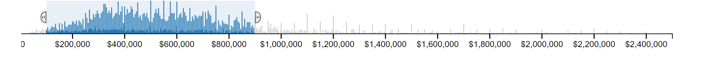
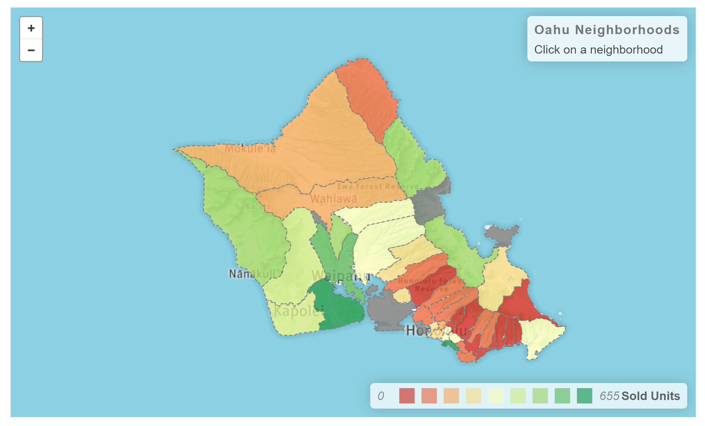
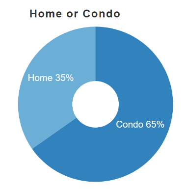
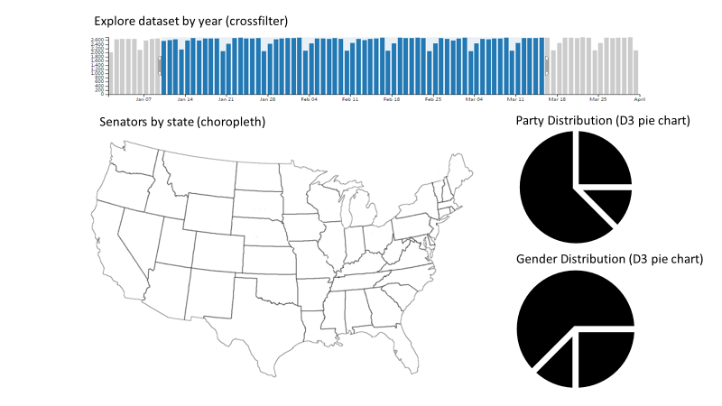

# Congress Dashboard

## Topic + Rational

Who has served in the U.S. Senate?
This dashboard will provide a visual representation of the party and gender make-up of U.S. Senate from 1789 through our most recent election in 2018.

## Data Set

[https://theunitedstates.io/congress-legislators/legislators-historical.json]

## Inspiration

Joon Yoo's Oaho real estate dashboard

## Sketch

## GitHub Repository

[https://github.com/brookemrod/congress_dashboard]